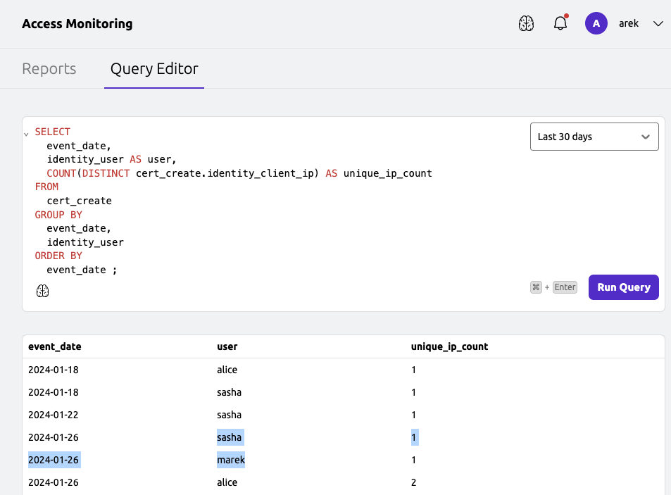
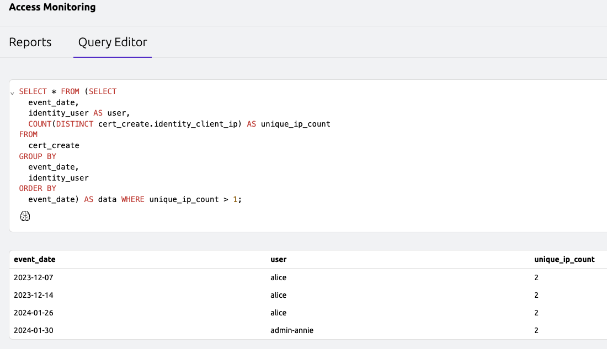
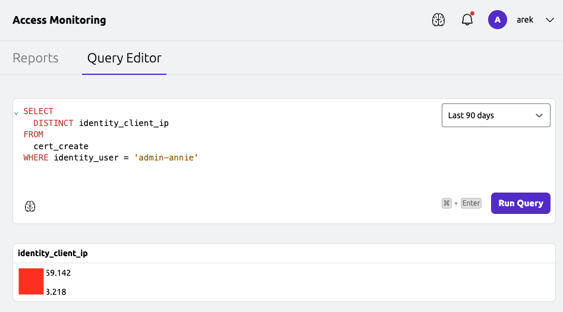
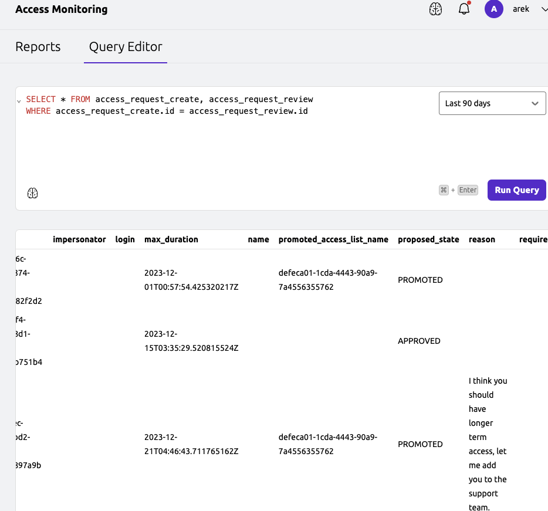
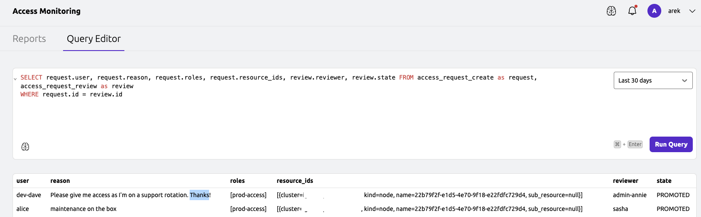

Teleport Access Monitoring allows to query and analyze the audit events generated by Teleport.
It provides a SQL interface to query the audit logs and generate reports.
Access Monitoring is a powerful tool to understand and analyze the access patterns in your Teleport cluster.
This guide will help you understand how to use Access Monitoring to monitor access to resources in your Teleport cluster.


## Prerequisites
- Teleport Cloud cluster v14.2.2 or later.

## Access Monitoring RBAC Permissions

To access the Access Monitoring interface, a user must have a role that allows
`list`, `read` and `use` verbs on the `audit_query` and `audit_query` resources.
By default the built-in `auditor` role has these permissions or you can create a custom role with these permissions e.g:
```yaml
kind: role
metadata:
  name: my-role
spec:
  allow:
    rules:
    - resources:
      - security_report
      verbs:
      - list
      - read
      - use
    - resources:
      - audit_query
      verbs:
      - list
      - read
      - use
```

## Query Editor
The Query Editor in Teleport Access Monitoring provides users with a powerful interface to interactively query audit logs and generate insightful reports.
It offers a user-friendly environment for constructing SQL queries tailored to specific use cases,
allowing users to gain deep insights into access patterns and security events within Teleport cluster.

Within the Query Editor, users have access to a diverse range of SQL views representing various audit events captured by Teleport.
These views provide a comprehensive overview of activities within the Teleport cluster, enabling users to construct precise queries tailored to their monitoring needs.
Below is a list of the available SQL views:

```
access_list_create
access_list_delete
access_list_member_create
access_list_member_delete
access_list_member_update
access_list_review
access_list_update
access_request_create
access_request_review
auth
bot_join
cert_create
db_session_query
db_session_query_failed
db_session_start
device_authenticate
device_enroll
exec
instance_join
join_token_create
kube_request
lock_created
lock_deleted
recovery_code_used
reset_password_token_create
saml_idp_auth
session_command
session_join
session_rejected
session_start
user_create
user_login
user_password_change
windows_desktop_session_end
windows_desktop_session_start
```

To access the Query Editor, navigate to the `Access Monitoring` section in the Teleport UI and click on the `Query Editor` tab.


### Here are a few query examples that demonstrate the capabilities of Access Monitoring

- Query for unique users who executed a ssh command involving `/etc/passwd` file in some way:
```sql
SELECT
  DISTINCT user
FROM
  exec
WHERE
  command LIKE '%/etc/passwd%';
```


- Select the count of unique IP addresses associated with each user cert over different event dates:
```sql
SELECT
  event_date,
  identity_user AS user,
  COUNT(DISTINCT cert_create.identity_client_ip) AS unique_ip_count
FROM
  cert_create
GROUP BY
  event_date,
  identity_user
ORDER BY
  event_date;
```




- Selects users who interacted with the Teleport cluster from more than one different IP address:
```sql
SELECT * FROM (SELECT
  event_date,
  identity_user AS user,
  COUNT(DISTINCT cert_create.identity_client_ip) AS unique_ip_count
FROM
  cert_create
GROUP BY
  event_date,
  identity_user
ORDER BY
  event_date) AS data WHERE unique_ip_count > 1;
```



- Sow all the unique IP addresses that were used by the user 'admin-annie':
```sql
SELECT
  DISTINCT identity_client_ip
FROM
  cert_create
WHERE identity_user = 'admin-annie'
```


- Show access requests and their reviews:
```sql
SELECT
  *
FROM
  access_request_create, access_request_review
WHERE
  access_request_create.id = access_request_review.id
```




- Show details about access request and review:
```sql
SELECT
  request.user, request.reason, request.roles, request.resource_ids, review.reviewer, review.state
FROM
  access_request_create as request, access_request_review as review
WHERE
  request.id = review.id
```



### Query Examples with Assist AI

AI assisted query is a feature of the Teleport Access Monitoring Query editor.
It provide SQL Query Suggestion suggestions based on the audit query schema available in your Teleport cluster.


In the result the Assist based on human text will generate the SQL query:


# Access Monitoring Reports
Access Monitoring provides pre built reports to help you monitor and analyze access patterns in your Teleport cluster.

- Privileged Access Report
    The `Privileged Access Report` reports offers valuable insight into identifying weak security events across infrastructure.
    The report allows to identify the following weak security events:

    - Database sessions with weak security
    - SSH sessions with weak security
    - Kubernetes API calls with weak security
    - Privileged Postgres sessions
    - Kube Execs
    - Long lived certificates
    - Long-lived join tokens
    - Root SSH sessions
    - System Kubernetes API calls

    You can find the `Privileged Access Report` report under the `Access Monitoring > Reports > Privileged Access Report` section:

    
